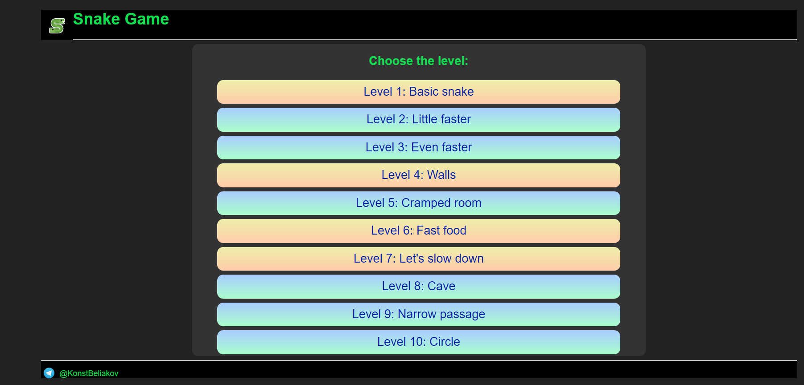
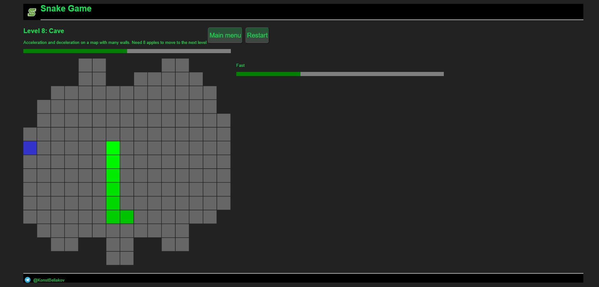

# Snake Game Project
This is snake game in JavaScript with many levels.
### How to install a project
1. Clone the repository
2. Open `index.html`  
Also you can run this project using [GitHub Pages](https://konstbeliakov.github.io/snake-js/)
---
### Main menu of the game

Levels with new game mechanics are highlighted in yellow
### Game mechanics
- **Level 1** - simple snake game
- **Level 4** - walls appear (if you crash into them the game will end)
- **Level 6** - items that speed up you for a few seconds appear (blue squares). 
- **Level 7** - items that slow you down for a few seconds appear (yellow squares)

### Game controls
You can control snake by pressing keys
- **w** - up
- **d** - right
- **s** - down
- **a** - left
---
*Thank you for your interest in my project!*

