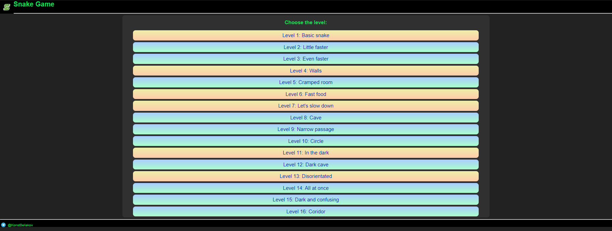
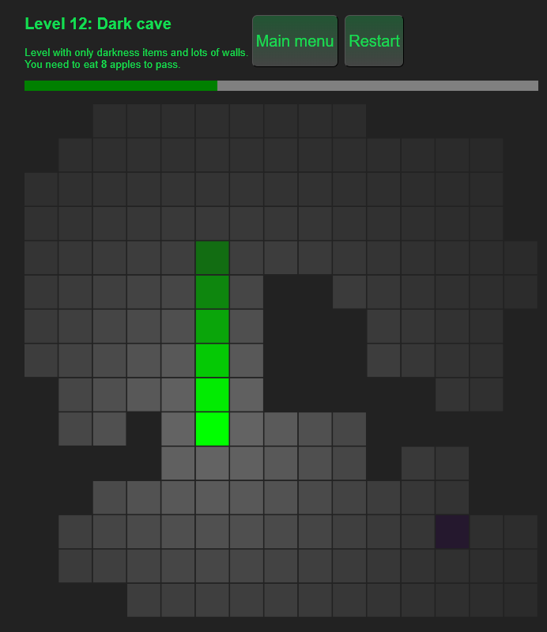

# Snake Game Project
This is snake game in JavaScript with many levels.
### How to install a project
1. Clone the repository
2. Open `index.html`  
Also you can run this project using [GitHub Pages](https://konstbeliakov.github.io/snake-js/)
---
### Main menu of the game

Levels with new game mechanics are highlighted in yellow
### Game mechanics
- **Level 1** - simple snake game
- **Level 4** - walls appear (if you crash into them the game will end)
- **Level 6** - items that speed up you for a few seconds appear (blue squares). 
- **Level 7** - items that slow you down for a few seconds appear (yellow squares)
- **Level 11** - items with darkness effect
- **Level 13** - items that invert controls for a while when eaten

### Game controls
You can control snake by pressing keys
- **w** - up
- **d** - right
- **s** - down
- **a** - left
### Adding new levels  
You can add new levels (or change existing) by changing file `levels.js`
```js
export const levels = [
// <...>
// object describing level 15
{
    // name of the level
    name: 'Level 15: Dark and confusing',
    // level description
    description: "Only darkness and disorientation items.<br>You need to eat <b>8</b> apples to pass.",
    // speed of the snake (tiles per second)
    speed: 10,
    // max length of the snake
    max: 11,
    // requirements of going to the next level
    next_level_requirements(snake){
        return snake.position.length >= 11;
    },
    // board (0 for empty cells and 1 for walls)
    board: [
        [0, 0, 0, 0, 0, 0, 1, 1, 0, 0, 0, 0, 0, 0, 0],
        [0, 0, 0, 0, 0, 0, 1, 1, 0, 0, 0, 0, 0, 0, 0],
        [0, 0, 0, 0, 0, 0, 1, 1, 0, 0, 0, 0, 0, 0, 0],
        [0, 0, 0, 0, 0, 0, 1, 1, 0, 0, 0, 0, 0, 0, 0],
        [0, 0, 0, 0, 0, 0, 1, 1, 0, 0, 0, 0, 0, 0, 0],
        [0, 0, 0, 0, 0, 0, 1, 1, 0, 0, 0, 0, 0, 0, 0],
        [0, 0, 0, 0, 0, 0, 1, 1, 0, 0, 0, 0, 0, 0, 0],
        [0, 0, 0, 0, 0, 0, 1, 1, 0, 0, 0, 0, 0, 0, 0],
        [0, 0, 0, 0, 0, 0, 1, 1, 0, 0, 0, 0, 0, 0, 0],
        [0, 0, 0, 0, 0, 0, 1, 1, 0, 0, 0, 0, 0, 0, 0],
        [0, 0, 0, 0, 0, 0, 0, 0, 0, 0, 0, 0, 0, 0, 0],
        [0, 0, 0, 0, 0, 0, 0, 0, 0, 0, 0, 0, 0, 0, 0],
        [0, 0, 0, 0, 0, 0, 0, 0, 0, 0, 0, 0, 0, 0, 0],
        [0, 0, 0, 0, 0, 0, 0, 0, 0, 0, 0, 0, 0, 0, 0],
        [0, 0, 0, 0, 0, 0, 0, 0, 0, 0, 0, 0, 0, 0, 0]
    ],
    // probabilities of items appearing on this level (in persents)
    items: [[DISORIENTATION_APPLE, 40], [DARKNESS_APPLE, 60]]
}
]
```
---
*Thank you for your interest in my project!*

